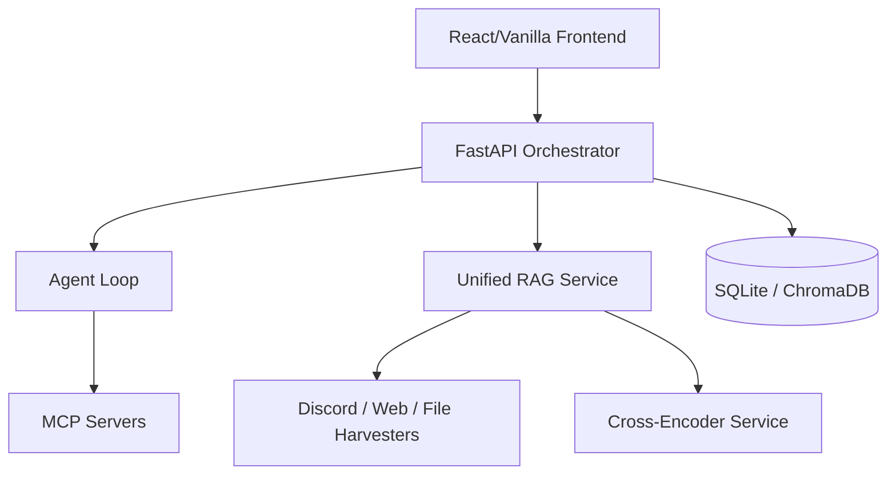

# REPOSITORY_MAP_V2: Pryneboard 2.0 (Unified)

## 1. Service Map
Pryneboard 2.0 is a **Polyglot Monorepo** (transitioning to Unified Python) composed of the following core services:

- **Workforce Intelligence (Odysseus):** The primary workspace coordinator. (Python/FastAPI)
- **Knowledge Pipeline (Hopper):** Specialized RAG and Discord harvesting. (TS/Node + Python Bot)
- **Model Orchestrator (Cookbook):** Manages local model downloads and serving.
- **Agent Orchestrator:** Manages tool execution and long-running research tasks.

---

## 2. Dependency Graph

---

## 3. File Ownership Map

### Core Infrastructure (`odysseus-SIDE-/core/`)
- `auth.py`: User session and token management.
- `database.py`: SQLite connection and migrations.
- `middleware.py`: Security and logging layers.

### Business Logic (`odysseus-SIDE-/src/`)
- `ai_interaction.py`: Core chat and LLM interfacing.
- `agent_loop.py`: Task management and tool execution.
- `document_processor.py`: File parsing and text normalization.
- `rag_vector.py`: ChromaDB storage and retrieval.
- `deep_research.py`: High-level reporting logic.

### RAG Specialization (`Hopper/`)
- `backend/discord_bot_starter/hopper_harvest.py`: Discord ingestion.
- `backend/src/core/retriever.ts`: Two-stage retrieval logic (Target for Python port).
- `backend/src/core/documentProcessor.ts`: Semantic deduplication (Target for Python port).

---

## 4. Entry Points
- **Web App:** `odysseus-SIDE-/app.py` (FastAPI).
- **Discord Harvester:** `Hopper/backend/discord_bot_starter/hopper_harvest.py`.
- **CLI Utilities:** `Hopper/backend/src/index.ts` (For ingestion/testing).

---

## 5. Data Flow Maps

### Ingestion Flow
`Source (PDF/Discord)` -> `Harvester` -> `Normalization` -> **`SHA-256 Hashing`** -> `Chunking` -> `Vectorization` -> `Storage (ChromaDB)`.

### Retrieval Flow
`Query` -> `Embedding` -> `Vector Search (Top 50)` -> **`Cross-Encoder Rerank (Top 5)`** -> `Context Assembly` -> `LLM Generation`.

### Agent Flow
`User Intent` -> `Reasoning Turn` -> `Tool Selection (MCP)` -> `Execution` -> `Observation` -> `Refinement` -> `Final Output`.

---

## 6. Technical Debt & Refactor Candidates

### Overlapping Functionality (Critical)
- **Document Processing:** Both `odysseus-SIDE-/src/document_processor.py` and `Hopper/.../documentProcessor.ts` do the same job. 
    - *Action:* Port Hopper's logic to the Python service and decommission the TS version.
- **RAG Implementation:** Two different retrieval strategies currently exist.
    - *Action:* Standardize on the "Precision Engine" (Two-stage) defined in Phase 1.

### Refactor Candidates
- **`odysseus-SIDE-/static/app.js`**: Massive monolithic file (~5k+ lines). High risk of regression. 
    - *Action:* Phase 3 will migrate this to React components.
- **`odysseus-SIDE-/app.py`**: Route registration is manual and bloated.
    - *Action:* Use FastAPI `APIRouter` to modularize endpoints by domain (e.g., `/chat`, `/rag`, `/admin`).

### Migration Risks
- **ChromaDB Versions:** Potential version mismatch between the TS client and Python client if not pinned.
- **Hardware Contention:** Running the Python Agent and the TS RAG backend simultaneously will exhaust local VRAM.

---

## 7. Dead Code Identification
- `Hopper/backend/src/server.ts`: This will be redundant once the FastAPI merger is complete.
- `odysseus-SIDE-/src/rag_manager.py`: Legacy single-stage RAG logic that should be superseded by `rag_vector.py`.

---
*Generated by Principal Software Architect*
